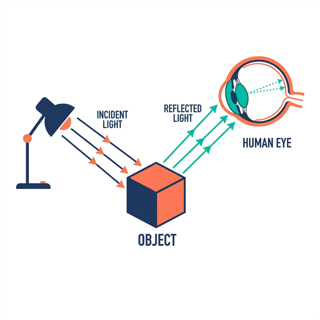

# 1. Digital Image Foundations {.sdaia-dark background-gradient="linear-gradient(135deg, #1C355E, #00C9A7)"}

How computers store images

## How We See: Light and The Human Eye

:::: {.columns}
::: {.column width="50%"}
- **1. Illumination**: Light from a source (e.g., the sun) hits an object.
- **2. Reflection**: The object absorbs some colors and reflects others.
- **3. Capture**: Reflected light enters the eye through the **pupil**.
- **4. Processing**: The lens focuses light onto the **retina**. *Photoreceptors* (rods and cones) convert it to electrical signals for the brain.
:::
::: {.column width="50%"}
{fig-align="center"}
<!-- Branded infographic of light reflecting into a human eye -->
:::
::::

## How Computers "See": The Digital Camera

```{=html}
<iframe class="interactive-demo r-stretch" src="assets/html/demo_camera_sensor.html" width="100%" height="600px" style="border:none;"></iframe>
```

## How Computers "See": Step by Step

- **1. Capture**: Just like the eye, the camera captures reflected light.
- **2. Lens & Aperture**: Light enters through an opening (aperture) and is focused by glass lenses.
- **3. The Sensor**: Instead of a retina, light hits a **digital sensor** (CMOS/CCD).
- **4. Digitization**: Millions of sensor *pixels* convert photons into electrical charges, creating a digital matrix (usually 8-bit).

::: {.callout-note appearance="simple"}
**Note**: In reality, lenses flip the image upside-down, and color sensors use a **Bayer Filter** to capture Red, Green, or Blue at each pixel.
:::

## Grayscale Images: Pixels & Coordinates

- Images are 2D matrices of numbers. The origin `(0,0)` is top-left.
- **8-bit Grayscale**: Each pixel is a number from `0` (black) to `255` (white).


::::: {.columns}

:::: {.column width="50%"}

```python
# 8x8 matrix (8-bit grayscale: 0-255)
img = np.array([
    [0,  0,  0,  0,  0,  0,  0,  0],
    [0,255,255,  0,  0,255,255,  0],
    [0,255,255,  0,  0,255,255,  0],
    [0,  0,  0,  0,  0,  0,  0,  0],
    [0,150,  0,  0,  0,  0,150,  0],
    [0,  0,255,255,255,255,  0,  0],
    [0,150,  0,  0,  0,  0,150,  0],
    [0,  0,  0,  0,  0,  0,  0,  0]
], dtype=np.uint8)
```

::::

:::: {.column width="50%"}

```{python}
#| echo: false
#| fig-align: center

import numpy as np
import matplotlib.pyplot as plt

# 8x8 matrix (8-bit grayscale: 0-255)
img = np.array([
    [0,  0,  0,  0,  0,  0,  0,  0],
    [0,255,255,  0,  0,255,255,  0],
    [0,255,255,  0,  0,255,255,  0],
    [0,  0,  0,  0,  0,  0,  0,  0],
    [0,150,  0,  0,  0,  0,150,  0],
    [0,  0,255,255,255,255,  0,  0],
    [0,150,  0,  0,  0,  0,150,  0],
    [0,  0,  0,  0,  0,  0,  0,  0]
], dtype=np.uint8)

fig, ax = plt.subplots(figsize=(4, 4))
ax.imshow(img, cmap='gray', vmin=0, vmax=255)

# Annotate pixels with their values
for i in range(8):
    for j in range(8):
        # Choose text color for readability (white text on dark pixels, black on light)
        color = 'white' if img[i, j] < 128 else 'black'
        ax.text(j, i, img[i, j], ha='center', va='center', color=color, fontsize=8)

ax.axis('off')
plt.show()
```
::::
:::::

## Coordinates vs. Array Indexing

:::: {.columns}
::: {.column width="50%"}
- We think in geometry: `(x, y)` = `(width, height)`.
- **NumPy** thinks in matrices: `matrix[row, col]` = `matrix[y, x]`.
- This causes endless confusion when cropping with bounding boxes `(x1, y1, x2, y2)`.
:::
::: {.column width="50%"}
```python
# Assuming a bounding box (x1, y1, x2, y2)

# WRONG (Crops wrong area or crashes)
crop = img[x1:x2, y1:y2] 

# CORRECT (y = row, x = col)
crop = img[y1:y2, x1:x2] 
```
:::
::::

## Color Images: The RGB Pixel {.smaller}

- In a color image, every pixel is a combination of 3 primary colors.
- A pixel at position $(x, y)$ is a **vector** of 3 values: $[R, G, B]$.
- Each value ranges from `0` to `255` (8-bit).

```{=html}
<iframe class="interactive-demo r-stretch" src="assets/html/demo_rgb_pixel.html" width="100%" height="500px" style="border:none;"></iframe>
```

## Color Images: The ML Perspective {.smaller}

- **Alternative View**: Instead of "pixels with 3 values", we see **3 separate layers**.
- This is how **Machine Learning** models (CNNs) "see" images as **Tensors**.
- Data structure: $(Height \times Width \times 3)$ or $(3 \times Height \times Width)$.

```{python}
#| echo: false
#| fig-align: center

import numpy as np
import matplotlib.pyplot as plt

# 4x4 image, 3 channels
H, W, C = 4, 4, 3

fig = plt.figure(figsize=(7, 7))
ax = fig.add_subplot(111, projection='3d')

# Voxels need to be boolean arrays
voxels = np.ones((C, W, H), dtype=bool)

# Define colors for each voxel
colors = np.empty(voxels.shape, dtype=object)

# Assign colors for each channel layer (using vibrant SDAIA palette style)
colors[0, :, :] = '#ff5e5e'  # Red channel
colors[1, :, :] = '#5eff5e'  # Green channel
colors[2, :, :] = '#5e5eff'  # Blue channel

# Plot voxels with transparency
ax.voxels(voxels, facecolors=colors, edgecolor='black', linewidth=0.3, alpha=0.7)

# Labels
ax.set_xlabel('Channels', labelpad=10, fontweight='bold')
ax.set_ylabel('Width', labelpad=10, fontweight='bold')
ax.set_zlabel('Height', labelpad=10, fontweight='bold')

# Adjust 3D view angle
ax.view_init(elev=25, azim=-45)

# Clean up axes
ax.grid(False)
ax.set_xticklabels([])
ax.set_yticklabels([])
ax.set_zticklabels([])

# Transparent panes
ax.xaxis.pane.fill = False
ax.yaxis.pane.fill = False
ax.zaxis.pane.fill = False
ax.xaxis.pane.set_edgecolor('w')
ax.yaxis.pane.set_edgecolor('w')
ax.zaxis.pane.set_edgecolor('w')

plt.tight_layout()
plt.show()
```


## Essential Image Libraries


:::: {.columns}

::: {.column width="33%"}
::: {.callout-note appearance="minimal" icon="false"}
<div style="text-align: center; font-size: 3rem; margin-bottom: 0.5rem;">📷</div>
<div style="text-align: center; font-size: 1.2rem; font-weight: bold; margin-bottom: 1rem; color: #1C355E;">OpenCV</div>

Very fast C++ library mapped to Python. 

- Uses **BGR** channel order
- Great for video streams 
- Low-level transforms
:::
:::

::: {.column width="33%"}
::: {.callout-tip appearance="minimal" icon="false"}
<div style="text-align: center; font-size: 3rem; margin-bottom: 0.5rem;">🖼️</div>
<div style="text-align: center; font-size: 1.2rem; font-weight: bold; margin-bottom: 1rem; color: #1C355E;">Pillow (PIL)</div>

Standard Python image library. 

- Uses **RGB** channel order
- Simple drawing & resizing 
- (Our primary tool)
:::
:::

::: {.column width="33%"}
::: {.callout-warning appearance="minimal" icon="false"}
<div style="text-align: center; font-size: 3rem; margin-bottom: 0.5rem;">🔢</div>
<div style="text-align: center; font-size: 1.2rem; font-weight: bold; margin-bottom: 1rem; color: #1C355E;">NumPy</div>

The core math library. 

- Images are fundamentally `numpy` tensors
- Multi-dimensional array operations
:::
:::

::::

## The "Smurf Effect": BGR vs. RGB

:::: {.columns}
::: {.column width="50%"}
- OpenCV historically uses **B**lue-**G**reen-**R**ed (**BGR**).
- Most other libraries (Matplotlib, Pillow) expect **R**ed-**G**reen-**B**lue (**RGB**).
- If you read an image with `cv2.imread()` and plot it directly in matplotlib, Red and Blue channels are swapped!
- *Faces look blue, skies look red.*
:::
::: {.column width="50%"}
#### Basic I/O Operations
```python
import cv2
import matplotlib.pyplot as plt

# 1. Read image (OpenCV loads BGR)
img_bgr = cv2.imread('dog.jpg')

# 2. Convert to RGB for accurate display
img_rgb = cv2.cvtColor(img_bgr, cv2.COLOR_BGR2RGB)

# 3. Display
plt.imshow(img_rgb)
plt.axis('off')
plt.show()
```
:::
::::

# Conclusion {.sdaia-dark background-gradient="linear-gradient(135deg, #1C355E, #00C9A7)"}

Wrapping up Image Foundations

## Summary

- **Light & Cameras**: How digital sensors capture light and turn it into data.
- **Pixels & Channels**: Grayscale (2D) vs. Color RGB (3D) representations.
- **Libraries**: Pillow and NumPy basics.
- **Gotchas**: BGR vs RGB (The Smurf Effect) and Array Indexing vs Coordinates.

## Next Steps

Next up: **YOLO Inference**

- Using these images with state-of-the-art Computer Vision models.
- Running inference directly out-of-the-box.

## Q&A {.sdaia-dark background-color="#1C355E"}

::: {.r-fit-text}
**Thank You!**

Any questions?
:::
