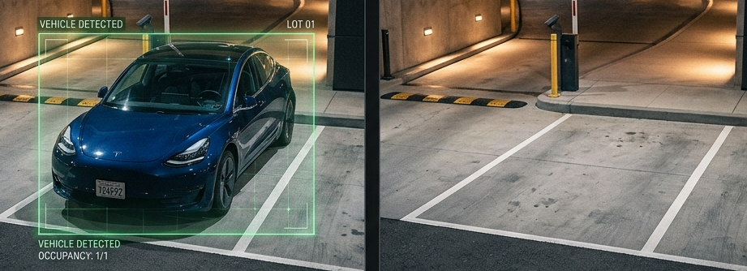
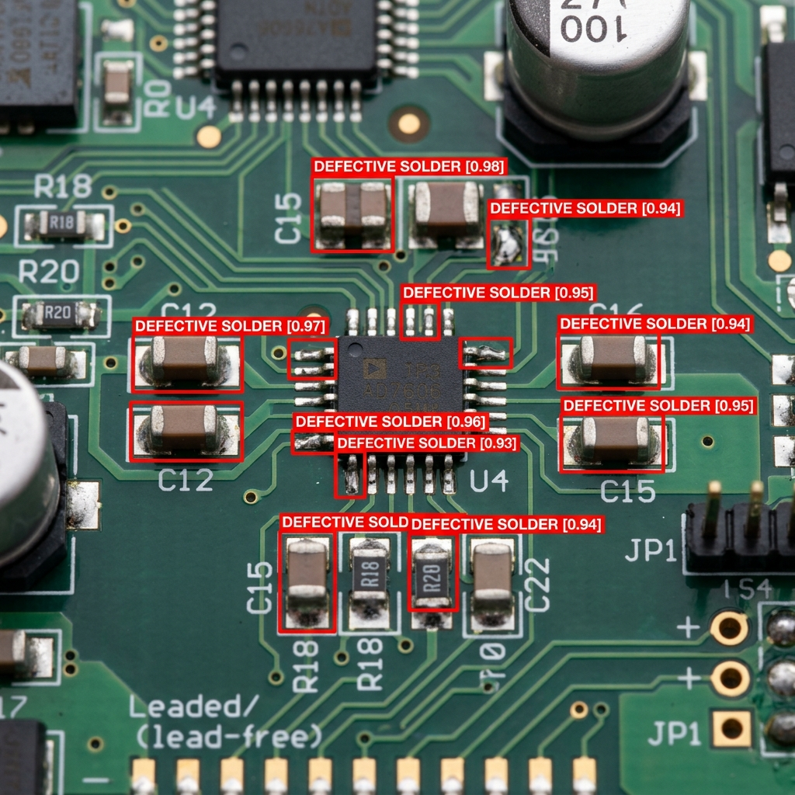

# 4. Model Evaluation {.sdaia-dark background-gradient="linear-gradient(135deg, #1C355E, #00C9A7)"}

How good is your model?

## Binary Classification Basics

Every prediction falls into one of four categories. Example: detecting a **"Car"**

```{=html}
<table style="width:90%; margin: 1.5rem auto; border-collapse: separate; border-spacing: 8px; font-size: 1em; text-align: center;">
  <tr>
    <td style="width:20%"></td>
    <th style="padding:0.6rem; color:#1C355E;">Predicted: Car</th>
    <th style="padding:0.6rem; color:#1C355E;">Predicted: Not Car</th>
  </tr>
  <tr>
    <th style="color:#1C355E; text-align:right; padding-right:0.8rem;">Actual: Car</th>
    <td style="background:#d4edda; padding:1rem; border-radius:8px;">✅ <strong>True Positive</strong><br><small>Correct detection</small></td>
    <td style="background:#f8d7da; padding:1rem; border-radius:8px;">❌ <strong>False Negative</strong><br><small>Missed car</small></td>
  </tr>
  <tr>
    <th style="color:#1C355E; text-align:right; padding-right:0.8rem;">Actual: Not Car</th>
    <td style="background:#fff3cd; padding:1rem; border-radius:8px;">⚠️ <strong>False Positive</strong><br><small>False alarm</small></td>
    <td style="background:#d4edda; padding:1rem; border-radius:8px;">✅ <strong>True Negative</strong><br><small>Correct rejection</small></td>
  </tr>
</table>
```

## Scenario: Smart Parking Camera

::: {style="font-size: 0.9em;"}
A camera at a parking entrance classifies each frame as **Car Present** or **Not**: 
:::

{fig-align="center"}

**Dataset:** 24 hours, 10,000 frames (~9s interval)

| | Count | % |
|---|---|---|
| Car Present | 500 | 5% |
| Empty Spot | 9,500 | 95% |

Most of the time, the spot is empty.


## The Problem with Accuracy

A "lazy" model that **always predicts "Empty"**:

::: {.fragment .fade-up}
- Finds **0 cars**
- Gets all 9,500 empty spots correct
:::

::: {.fragment .fade-up}
$$Accuracy = \frac{9{,}500}{10{,}000} = 95\%$$
:::

::: {.fragment .fade-up}
**95% Accuracy** — yet it never detects a single car. This is the **Class Imbalance Problem**.
:::


## Balanced Accuracy: A Quick Fix

Instead of overall accuracy, we average the per-class accuracies so each class counts equally.

::: {.fragment .fade-up}
**Applied to our "Lazy" Model:**

- **Car Accuracy:** 0 / 500 = **0%**
- **Empty Accuracy:** 9,500 / 9,500 = **100%**
- **Balanced Accuracy:** $(0\% + 100\%) / 2 = \mathbf{50\%}$
:::

::: {.fragment .fade-up}
Balanced Accuracy correctly flags the lazy model as a failure, even though its "standard" accuracy was 95%!
:::


## Balanced Accuracy: The Hidden Problem

**What if our model catches every car, but is "trigger-happy"?**

:::: {.columns}

::: {.column width="55%"}
```{python}
#| echo: false
#| fig-align: center
import matplotlib.pyplot as plt
import numpy as np

fig, ax = plt.subplots(figsize=(5, 3.5))
fig.patch.set_alpha(0.0)
ax.patch.set_alpha(0.0)

categories = ['True Positives\n(Cars caught)', 'False Positives\n(Empty → "Car")', 'False Negatives\n(Cars missed)', 'True Negatives\n(Correct Rejection)']
values = [500, 1900, 0, 7600]
colors = ['#28a745', '#dc3545', '#ffc107', '#17a2b8']

bars = ax.barh(categories, values, color=colors, height=0.5, edgecolor='white', linewidth=1.5)
for bar, val in zip(bars, values):
    ax.text(bar.get_width() + 100, bar.get_y() + bar.get_height()/2,
            f'{val:,}', va='center', ha='left', fontsize=11, fontweight='bold', color='#1C355E')

ax.set_xlim(0, 9000)
ax.spines['top'].set_visible(False)
ax.spines['right'].set_visible(False)
ax.spines['bottom'].set_color('#1C355E')
ax.spines['left'].set_visible(False)
ax.tick_params(left=False, colors='#1C355E', labelsize=9)
ax.set_title('Trigger-Happy Model Results', fontsize=13, fontweight='bold', color='#1C355E')
plt.tight_layout()
plt.show()
```
:::

::: {.column width="45%"}
::: {style="font-size: 0.85em;"}
::: {.fragment .fade-up}
- **Car Accuracy:** 100%
- **Empty Accuracy:** 80%

$$\frac{100\% + 80\%}{2} = \mathbf{90\%}$$
:::

::: {.fragment .fade-up}
::: {.callout-warning appearance="minimal"}
**90% looks great** — but that's **1,900 false alarms** hidden inside the score.
:::
:::

::: {.fragment .fade-up}
::: {.callout-tip appearance="minimal"}
**The TN "Trap":** The **7,600 True Negatives** (correctly ignoring empty spots) are what inflate the accuracy while the false alarms flood your system.
:::
:::
:::
:::

::::


## Precision and Recall

Two metrics that ignore True Negatives entirely (correctly classified Empty spot):

::: {.incremental}
- **Precision:** When the model flags a "Car", is it actually a Car? *(Quality)*
  $$Precision = \frac{TP}{TP + FP}$$
- **Recall:** Out of all actual Cars, how many did the model find? *(Quantity)*
  $$Recall = \frac{TP}{TP + FN}$$
:::


## Case Study: Two Models

We have **500 actual cars**. How would these two models handle them?

::: {.incremental}
- **Model A:** "Over-Sensitive" (Flags everything)
- **Model B:** "Cautious" (Flags only sure bets)
:::


## Model A: "Over-Sensitive"

*Flags everything — never misses a car*

```{python}
#| echo: false
#| fig-align: center
import matplotlib.pyplot as plt
import numpy as np

fig, ax = plt.subplots(figsize=(7, 4))
fig.patch.set_alpha(0.0)
ax.patch.set_alpha(0.0)

# Data for Model A
categories = ['True Positives\n(Caught)', 'False Positives\n(False Alarms)', 'False Negatives\n(Missed)']
values = [500, 1900, 0]
colors = ['#28a745', '#dc3545', '#ffc107']

bars = ax.barh(categories, values, color=colors, height=0.5, edgecolor='white', linewidth=1.5)

# Add value labels
for bar, val in zip(bars, values):
    ax.text(bar.get_width() + 30, bar.get_y() + bar.get_height()/2, 
            str(val), va='center', ha='left', fontsize=13, fontweight='bold', color='#1C355E')

ax.set_xlim(0, 2400)
ax.spines['top'].set_visible(False)
ax.spines['right'].set_visible(False)
ax.spines['bottom'].set_color('#1C355E')
ax.spines['left'].set_visible(False)
ax.tick_params(left=False, colors='#1C355E', labelsize=11)
ax.set_title('Model A: Predicted 2,400 "Cars"', fontsize=14, fontweight='bold', color='#1C355E')
ax.set_xlabel('Count', fontsize=12, color='#1C355E')

plt.tight_layout()
plt.show()
```

::: {.fragment .fade-up}
- **Recall:** 500 / 500 = **100%**
- **Precision:** 500 / 2,400 ≈ **20.8%**
:::


## Model B: "Cautious"

*Only flags when very confident*

```{python}
#| echo: false
#| fig-align: center
import matplotlib.pyplot as plt
import numpy as np

fig, ax = plt.subplots(figsize=(7, 4))
fig.patch.set_alpha(0.0)
ax.patch.set_alpha(0.0)

# Data for Model B
categories = ['True Positives\n(Caught)', 'False Positives\n(False Alarms)', 'False Negatives\n(Missed)']
values = [350, 0, 150]
colors = ['#28a745', '#dc3545', '#ffc107']

bars = ax.barh(categories, values, color=colors, height=0.5, edgecolor='white', linewidth=1.5)

# Add value labels
for bar, val in zip(bars, values):
    ax.text(bar.get_width() + 20, bar.get_y() + bar.get_height()/2, 
            str(val), va='center', ha='left', fontsize=13, fontweight='bold', color='#1C355E')

ax.set_xlim(0, 550)
ax.spines['top'].set_visible(False)
ax.spines['right'].set_visible(False)
ax.spines['bottom'].set_color('#1C355E')
ax.spines['left'].set_visible(False)
ax.tick_params(left=False, colors='#1C355E', labelsize=11)
ax.set_title('Model B: Predicted 350 "Cars"', fontsize=14, fontweight='bold', color='#1C355E')
ax.set_xlabel('Count', fontsize=12, color='#1C355E')

plt.tight_layout()
plt.show()
```

::: {.fragment .fade-up}
- **Recall:** 350 / 500 = **70%**
- **Precision:** 350 / 350 = **100%**
:::


## (Reminder) Model Output: Confidence $\neq$ Label

:::: {.columns}

::: {.column width="55%"}
```{=html}
<div style="display:flex; flex-direction:column; align-items:center; gap:0.6rem; margin-top:1.2rem; font-size:0.9em;">
  <div style="background:rgba(28,53,94,0.10); border-radius:10px; padding:0.8rem 1.4rem; text-align:center; width:80%;">
    🧠 <strong>Model</strong><br>
    <span style="color:#1C355E;">Raw confidence scores</span>
  </div>
  <div style="font-size:1.4rem; color:#1C355E;">↓</div>
  <div style="background:rgba(255,140,0,0.12); border:2px dashed #FF8C00; border-radius:10px; padding:0.8rem 1.4rem; text-align:center; width:80%;">
    ⚙️ <strong>Threshold Gate</strong><br>
    <span style="color:#FF8C00;">Is score ≥ threshold?</span>
  </div>
  <div style="font-size:1.4rem; color:#1C355E;">↓</div>
  <div style="background:rgba(0,201,167,0.12); border-radius:10px; padding:0.8rem 1.4rem; text-align:center; width:80%;">
    🏷️ <strong>Label</strong><br>
    <span style="color:#00C9A7;">"Car" / "Not Car"</span>
  </div>
</div>
```
:::

::: {.column width="45%"}
<br>
**The Model** outputs scores, not decisions:

> "I am **72%** sure this is a car."

::: {.fragment .fade-up}
**We** decide the label:

- **Classification:** top score wins (`top1`)
- **Detection:** only boxes above the confidence threshold are shown
:::
:::

::::


## Interactive Demo: Threshold Trade-off

```{=html}
<iframe class="interactive-demo" src="assets/html/demo_threshold.html" width="100%" height="90%" style="border:none; overflow:hidden;"></iframe>
```


## The Trade-off: Precision vs. Recall

Raising or lowering your confidence threshold shifts the balance:

:::: {.columns}

::: {.column style="background: rgba(220,53,69,0.08)"}
### 🎯 High Threshold (`0.80`)
**Strict** — only "sure bets" pass

↑ **Precision** (fewer false alarms)

↓ **Recall** (more misses)
:::

::: {.column style="background: rgba(0,201,167,0.08)"}
### 🔍 Low Threshold (`0.20`)
**Loose** — catch everything

↑ **Recall** (fewer misses)

↓ **Precision** (more false alarms)
:::

::::


## F1 Score: Balancing Precision & Recall

**Which single number combines both?**

$$F_1 = 2 \times \frac{Precision \times Recall}{Precision + Recall}$$

::: {.callout-note appearance="minimal"}
A **0** in either metric drags the whole score down — you can't hide behind one strong number.
:::


## F1 Score: Model Comparison

```{python}
#| echo: false
#| fig-align: center
import matplotlib.pyplot as plt
import numpy as np

models = ['Model A\n(Over-Sensitive)', 'Model B\n(Cautious)']
precision_vals = [20.8, 100]
recall_vals = [100, 70]
f1_vals = [2 * p * r / (p + r) for p, r in zip(precision_vals, recall_vals)]
balanced_accuracy_vals = [90.0, 85.0]

x = np.arange(len(models))
width = 0.18

fig, ax = plt.subplots(figsize=(10, 5))
fig.patch.set_alpha(0.0)
ax.patch.set_alpha(0.0)

bars1 = ax.bar(x - 1.5*width, precision_vals, width, label='Precision', color='#1C355E', alpha=0.85)
bars2 = ax.bar(x - 0.5*width, recall_vals, width, label='Recall', color='#00C9A7', alpha=0.85)
bars3 = ax.bar(x + 0.5*width, f1_vals, width, label='F1 Score', color='#FF8C00', alpha=0.9)
bars4 = ax.bar(x + 1.5*width, balanced_accuracy_vals, width, label='Balanced Acc', color='#6f42c1', alpha=0.85)

# Add value labels for F1 and Balanced Accuracy
for bar in bars3:
    ax.text(bar.get_x() + bar.get_width()/2., bar.get_height() + 1.5,
            f'{bar.get_height():.1f}%', ha='center', va='bottom',
            fontsize=10, fontweight='bold', color='#FF8C00')

for bar in bars4:
    ax.text(bar.get_x() + bar.get_width()/2., bar.get_height() + 1.5,
            f'{bar.get_height():.1f}%', ha='center', va='bottom',
            fontsize=10, fontweight='bold', color='#6f42c1')

ax.set_ylabel('Score (%)', fontsize=12, color='#1C355E')
ax.set_xticks(x)
ax.set_xticklabels(models, fontsize=11, color='#1C355E')
ax.set_ylim(0, 115)
ax.legend(frameon=False, fontsize=10, loc='upper center', bbox_to_anchor=(0.5, 1.15), ncol=4)
ax.spines['top'].set_visible(False)
ax.spines['right'].set_visible(False)
ax.spines['bottom'].set_color('#1C355E')
ax.spines['left'].set_color('#1C355E')
ax.tick_params(colors='#1C355E')

plt.tight_layout()
plt.show()
```

::: {.callout-tip appearance="minimal"}
F1 exposes Model A's flaw: 1,900 false alarms inflate Recall but tank Precision — F1 = **34.4%**.
:::


## Choosing the Right Threshold

```{python}
#| echo: false
#| fig-align: center
import numpy as np
import matplotlib.pyplot as plt

conf = np.linspace(0.01, 0.99, 200)

# Simulate recall: drops off as threshold increases
recall = 1 / (1 + np.exp(8 * (conf - 0.6)))

# Simulate precision: rises as threshold increases
precision = 1 / (1 + np.exp(-8 * (conf - 0.35)))

# F1 score
f1 = 2 * precision * recall / (precision + recall + 1e-9)

best_idx = np.argmax(f1)
best_conf = conf[best_idx]
best_f1 = f1[best_idx]

fig, ax = plt.subplots(figsize=(7, 4.5))
fig.patch.set_alpha(0.0)
ax.patch.set_alpha(0.0)

ax.plot(conf, f1,        color='#FF8C00', linewidth=3,   label='F1')
ax.plot(conf, precision, color='#1C355E', linewidth=2.5, linestyle='--', label='Precision')
ax.plot(conf, recall,    color='#00C9A7', linewidth=2.5, linestyle='--', label='Recall')

ax.axvline(best_conf, color='#dc3545', linewidth=2, linestyle=':')
ax.scatter([best_conf], [best_f1], color='#dc3545', zorder=5, s=80)
ax.annotate(f'Best F1 @ conf={best_conf:.2f}',
            xy=(best_conf, best_f1),
            xytext=(best_conf + 0.08, best_f1 - 0.12),
            fontsize=10, color='#dc3545',
            arrowprops=dict(arrowstyle='->', color='#dc3545'))

ax.set_xlabel('Confidence Threshold', fontsize=12, color='#1C355E')
ax.set_ylabel('Score', fontsize=12, color='#1C355E')
ax.set_xlim(0, 1)
ax.set_ylim(0, 1.05)
ax.legend(frameon=False, fontsize=11, labelcolor='#1C355E')
ax.spines['top'].set_visible(False)
ax.spines['right'].set_visible(False)
ax.spines['bottom'].set_color('#1C355E')
ax.spines['left'].set_color('#1C355E')
ax.tick_params(colors='#1C355E')
ax.grid(True, linestyle='--', alpha=0.25, color='#1C355E')
plt.tight_layout()
plt.show()
```


::: {.callout-tip appearance="minimal" .fragment .fade-up}
Ultralytics saves `F1_curve.png` and `R_curve.png` in your training results automatically.
:::


## Case Study: Translating Metrics to ROI

Accuracy and F1 are great for engineers, but management speaks one language: **Money.**

::: {style="font-size: 0.9em;"}
**Scenario:** A Digital Factory produces high-end circuit boards. We deploy a YOLO model to detect "Defective Solders" before shipping. 
:::

{fig-align="center" width="75%"}

```{python}
#| echo: false
import numpy as np

# Financial Parameters
COST_FN = 500
COST_FP = 25
TOTAL_DEFECTS = 500
TOTAL_GOOD = 9500

# Generate synthetic data
np.random.seed(42)
scores_defects = np.random.normal(0.55, 0.20, TOTAL_DEFECTS)
scores_good = np.random.normal(0.10, 0.03, TOTAL_GOOD)
scores_defects = np.clip(scores_defects, 0.01, 0.99)
scores_good = np.clip(scores_good, 0.01, 0.99)

def get_roi_stats(t):
    fn = np.sum(scores_defects < t)
    fp = np.sum(scores_good >= t)
    return fn, fp, (fn * COST_FN + fp * COST_FP)

# Pre-calculate thresholds of interest
t_a = 0.35
fn_a, fp_a, cost_a = get_roi_stats(t_a)

# Find best threshold (matching plot logic)
thresholds = np.linspace(0.01, 0.99, 200)
all_costs = [get_roi_stats(t)[2] for t in thresholds]
best_idx = np.argmin(all_costs)
t_best = thresholds[best_idx]
fn_best, fp_best, cost_best = get_roi_stats(t_best)

savings = cost_a - cost_best
```


## Cost of Every Prediction

Every prediction in our Digital Factory has a tangible financial consequence:

::: {.incremental}
- ✅ **True Positive (TP):** Defect caught, scrapped early. (Baseline)
- ✅ **True Negative (TN):** Good board ships. (Baseline)
- ❌ **False Negative (FN):** Defective board ships to a customer. **Cost: $500** *(Warranty, shipping, brand damage).*
- ⚠️ **False Positive (FP):** Good board flagged as defective. Requires manual inspection. **Cost: $25** *(Labor).*
:::


## The Financial Confusion Matrix

If we test our model on a batch of **10,000 boards** (where 5% actually have defects):

```{=html}
<table style="width:90%; margin: 1.5rem auto; border-collapse: separate; border-spacing: 8px; font-size: 1.1em; text-align: center;">
  <tr>
    <td style="width:20%"></td>
    <th style="padding:0.6rem; color:#1C355E;">Predicted: Defect</th>
    <th style="padding:0.6rem; color:#1C355E;">Predicted: Good</th>
  </tr>
  <tr>
    <th style="color:#1C355E; text-align:right; padding-right:0.8rem;">Actual: Defect</th>
    <td style="background:#d4edda; padding:1rem; border-radius:8px;">✅ <strong>TP</strong><br><small>Cost: $0</small></td>
    <td style="background:#f8d7da; padding:1rem; border-radius:8px;">❌ <strong>FN (Missed)</strong><br><small style="color:#dc3545; font-weight:bold;">Cost: $500 each</small></td>
  </tr>
  <tr>
    <th style="color:#1C355E; text-align:right; padding-right:0.8rem;">Actual: Good</th>
    <td style="background:#fff3cd; padding:1rem; border-radius:8px;">⚠️ <strong>FP (False Alarm)</strong><br><small style="color:#FF8C00; font-weight:bold;">Cost: $25 each</small></td>
    <td style="background:#d4edda; padding:1rem; border-radius:8px;">✅ <strong>TN</strong><br><small>Cost: $0</small></td>
  </tr>
</table>
```

::: {.fragment .fade-up style="text-align: center; margin-top: 1rem;"}
```{python}
#| echo: false
#| output: asis
print(f"**Total Financial Loss = $(FN \\times \\${COST_FN}) + (FP \\times \\${COST_FP})$**")
```
:::


## Baselines: The Cost of "Dumb" Decisions

What if we didn't use AI at all? Let's look at the financial impact of the two simplest "Dummy" strategies:

```{python}
#| echo: false
#| output: asis

ship_everything_cost = TOTAL_DEFECTS * COST_FN
scrap_everything_cost = TOTAL_GOOD * COST_FP

print(f"""
:::: {{.columns}}

::: {{.column width="50%" .fragment}}
### 🚢 "Ship Everything"
*Assume every board is Good*

- **False Negatives (FN):** {TOTAL_DEFECTS}
- **Cost:** \\${COST_FN}$ \\times {TOTAL_DEFECTS}$
- **Total Loss:** [**\\${ship_everything_cost:,}**]{{style="color:#dc3545; font-size:1.2em;"}}
:::

::: {{.column width="50%" .fragment}}
### ⚙️ "Scrap Everything"
*Assume every board is Defective*

- **False Positives (FP):** {TOTAL_GOOD}
- **Cost:** \\${TOTAL_GOOD:,}$ \\times {COST_FP}$
- **Total Loss:** [**\\${scrap_everything_cost:,}**]{{style="color:#FF8C00; font-size:1.2em;"}}
:::

::::
""")
```

::: {.fragment .fade-up style="text-align: center; margin-top: 1.5rem;"}
::: {.callout-tip appearance="minimal"}
**The Conclusion:** Even a "basic" model saves the company hundreds of thousands of dollars per batch. Now let's see how much *more* we can save by optimizing.
:::
:::


## Optimizing for Profit, Not Just F1

Remember how F1 balances Precision and Recall? When money is involved, the balance changes.

```{python}
#| echo: false
#| output: asis

print(f"""
:::: {{.columns}}

::: {{.column width="50%" .fragment .fade-up}}
### Option A: Max F1 Score
Balanced threshold (conf={t_a:.2f})

- **FN (Missed):** {fn_a} boards $\\times \\${COST_FN}$ = $\\${cost_a:,}$
- **FP (False Alarms):** {fp_a} boards $\\times \\${COST_FP}$ = $\\${fp_a * COST_FP:,}$
- **Total Loss:** <span style="color:#dc3545; font-weight:bold;">\\${cost_a:,}</span>
:::

::: {{.column width="50%" .fragment .fade-up}}
### Option B: Max ROI
Loose threshold (conf={t_best:.2f})

- **FN (Missed):** {fn_best} boards $\\times \\${COST_FN}$ = $\\${fn_best * COST_FN:,}$
- **FP (False Alarms):** {fp_best} boards $\\times \\${COST_FP}$ = $\\${fp_best * COST_FP:,}$
- **Total Loss:** <span style="color:#00C9A7; font-weight:bold;">\\${cost_best:,}</span>
:::

::::

::: {{.callout-important appearance="minimal" .fragment .fade-up}}
By lowering our threshold and accepting a few False Positives, we saved the business over **\\${savings:,}** per batch. We optimized for the **business metric**, not the machine learning metric.
:::
""")
```


## The Cost Curve

Just like we plotted the F1 curve, we can plot a **Cost Curve** to find the optimal threshold for deployment.

```{python}
#| echo: false
#| fig-align: center
import matplotlib.pyplot as plt
import matplotlib.ticker as ticker

# Calculate costs across thresholds for the line plot
# (using thresholds and all_costs pre-calculated in the setup block)
total_costs = np.array(all_costs)

# Plot
fig, ax = plt.subplots(figsize=(8, 4.5))
fig.patch.set_alpha(0.0)
ax.patch.set_alpha(0.0)

ax.plot(thresholds, total_costs, color='#1C355E', linewidth=3, label='Total Financial Loss ($)')

# Highlight minimum cost
ax.axvline(t_best, color='#00C9A7', linewidth=2, linestyle=':')
ax.scatter([t_best], [cost_best], color='#00C9A7', zorder=5, s=80)
ax.annotate(f'Best ROI @ conf={t_best:.2f}\nCost: ${cost_best:,.0f}',
            xy=(t_best, cost_best),
            xytext=(t_best + 0.05, cost_best + 20000),
            fontsize=11, fontweight='bold', color='#00C9A7',
            arrowprops=dict(arrowstyle='->', color='#00C9A7', lw=2))

# Formatting
ax.set_xlabel('Confidence Threshold', fontsize=12, color='#1C355E')
ax.set_ylabel('Total Cost ($)', fontsize=12, color='#1C355E')
ax.set_title('Financial Loss vs. Confidence Threshold', fontsize=14, fontweight='bold', color='#1C355E')
ax.set_xlim(0, 1)

# Clean up spines and match brand colors
ax.spines['top'].set_visible(False)
ax.spines['right'].set_visible(False)
ax.spines['bottom'].set_linewidth(2)
ax.spines['bottom'].set_color('#1C355E')
ax.spines['left'].set_linewidth(2)
ax.spines['left'].set_color('#1C355E')

ax.tick_params(colors='#1C355E', width=2, labelsize=12)
ax.grid(True, linestyle='--', alpha=0.3, color='#1C355E')

# Format Y axis as currency
formatter = ticker.StrMethodFormatter('${x:,.0f}')
ax.yaxis.set_major_formatter(formatter)

ax.legend(loc='upper right', frameon=False, fontsize=12, labelcolor='#1C355E')

plt.tight_layout()
plt.show()
```

## 🧪 Lab 4A: ROI-Driven Evaluation

Now it's your turn to play the role of the Business Lead!

1. Open `labs/04a_roi_evaluation.ipynb`
2. Scroll to the **"ROI-Driven Evaluation"** section.
3. Find the optimal threshold for the **Shoplifting Detection** case study in **Lab 4A**.

::: {.callout-tip appearance="minimal"}
**Scenario Summary:**

- **Goal:** Minimize Total Financial Loss.
- **Costs:** Missed Shoplifter ($50) vs. Wrongful Accusal ($2,500).
:::


## The Threshold Dilemma

All metrics so far ($F1$, $ROI$, $Precision$) require us to **choose** a threshold first.

:::: {.columns}

::: {.column width="50%"}
### 🎯 The "Decision" View
Useful for **deployment**.
*"At 0.45 confidence, what is my profit?"*

- Pick one point on the curve.
- Optimize for a specific business case.
- Good for **operational decisions**.
:::

::: {.column width="50%" .fragment .incremental}
### 📊 The "Model" View
Useful for **benchmarking**.
*"Is this model fundamentally better than the last one?"*

- Evaluate over **all thresholds**.
- Compare architectures fairly.
- **This is where Average Precision (AP) comes in.**
:::

::::


## The PR Curve & Average Precision (AP)


:::: {.columns}

::: {.column width="50%"}
<br>

::: {.fragment .fade-up}
**Step 1: Gather**
We take every "Car" prediction the model made across the whole test set.
:::

<br>

::: {.fragment .fade-up}
**Step 2: Sort**
We sort them from highest confidence (e.g., $0.99$) to lowest (e.g., $0.10$).
:::

<br>

::: {.fragment .fade-up}
**Step 3: Calculate**
We calculate Precision and Recall at every single step of that sorted list.
:::

<br>

:::

::: {.column width="50%"}
```{python}
#| echo: false
#| fig-align: center
import matplotlib.pyplot as plt
import numpy as np

fig, ax = plt.subplots(figsize=(6, 5))
fig.patch.set_alpha(0.0)
ax.patch.set_alpha(0.0)

recall = np.linspace(0, 1, 100)
# Mock PR curve
precision = 1 - recall**3 + 0.1 * np.random.rand(100)
precision = np.clip(precision, 0, 1)
precision = np.maximum.accumulate(precision[::-1])[::-1] # Make it monotonically decreasing

ax.plot(recall, precision, color='#00C9A7', linewidth=4, label='PR Curve')
ax.fill_between(recall, precision, alpha=0.3, color='#00C9A7', label='AP (Area)')

ax.set_xlabel('Recall', fontsize=14, fontweight='bold', color='#1C355E')
ax.set_ylabel('Precision', fontsize=14, fontweight='bold', color='#1C355E')
ax.set_xlim(0, 1)
ax.set_ylim(0, 1.05)

# Clean up spines and match brand colors
ax.spines['top'].set_visible(False)
ax.spines['right'].set_visible(False)
ax.spines['bottom'].set_linewidth(2)
ax.spines['bottom'].set_color('#1C355E')
ax.spines['left'].set_linewidth(2)
ax.spines['left'].set_color('#1C355E')

ax.tick_params(colors='#1C355E', width=2, labelsize=12)
ax.grid(True, linestyle='--', alpha=0.3, color='#1C355E')
ax.legend(loc='lower left', frameon=False, fontsize=12, labelcolor='#1C355E')

plt.tight_layout()
plt.show()
```

::: {.fragment .fade-up}
::: {.callout-note appearance="simple"}
**Average Precision (AP)** is simply the area under this **Precision-Recall (PR) curve**!
:::
:::

:::

::::


## From Binary to Multi-Class: One-vs-Rest (most common)

When we have many classes, we reduce the problem to binary by isolating each class.

::: {.fragment .fade-up style="text-align: center; font-size: 1.1em; margin: 1rem 0;"}
> Pick **one class** as *Positive* — everything else is *Negative*. Repeat for every class.
:::

::: {.fragment .fade-up}
> This logic applies to **any** binary metric like Precision, Recall, AP, etc.
:::


## Per-Class Recall Formula

For a specific class $i$, treat it as **"positive"** and all others as **"negative"**:

$$Recall_i = \frac{TP_i}{TP_i + FN_i}$$

::: {.fragment .fade-up style="margin-top: 1.5rem;"}
:::: {.columns}

::: {.column width="50%"}
::: {.callout-note appearance="minimal"}
**$TP_i$** — instances of class $i$ correctly predicted as class $i$
:::
:::

::: {.column width="50%"}
::: {.callout-warning appearance="minimal"}
**$FN_i$** — instances of class $i$ predicted as **any other class**
:::
:::

::::
:::


## Ways to Aggregate Per-Class Scores

Once you have a score per class, you combine them into a single number:

::: {.fragment .fade-up style="margin-top: 0.5rem;"}
| Strategy | Formula | Character |
|---|---|---|
| **Macro** | $\frac{\sum M_i}{n}$ | All classes equally weighted |
| **Micro** | $\frac{\sum \text{Num}_i}{\sum \text{Denom}_i}$ | Pooled counts (treats every sample equally) |
| **Weighted** | $\frac{\sum M_i \cdot S_i}{\sum S_i}$ | Weighted by class size (Support) |
:::
 
::: {.fragment .fade-up style="font-size: 0.75em; text-align: center; opacity: 0.85; margin-top: 0.5rem;"}
**$M_i$**: Metric per class ($P, R, AP$) <br>
**$S_i$**: Support (class size) <br>
**$\text{Num}_i / \text{Denom}_i$**: Numerator / Denominator (e.g., $TP / (TP+FP)$)
:::
 
::: {.fragment .fade-up}
::: {.callout-tip appearance="minimal" style="margin-top: 1rem;"}
**mAP = Macro-Average of per-class AP scores.** Every class contributes equally.
:::
:::


## But Does Location Matter?

Precision and Recall measure **whether** a classification is correct.

For object detection, the model must also get the **location** right.

::: {.fragment .fade-up}
> A confident prediction placed in the wrong spot is still a wrong prediction.
:::

::: {.fragment .fade-up}
That's where **Intersection over Union (IoU)** comes in.
:::

## Intersection over Union (IoU)

How perfectly does the predicted bounding box overlap the *ground truth* box?

```{python}
#| echo: false
#| fig-align: center
import matplotlib.pyplot as plt
import matplotlib.patches as patches
import numpy as np
import sys; import os; sys.path.insert(0, os.path.abspath('.')); sys.path.insert(0, os.path.abspath('slides')); from plot_utils import draw_base_car

fig, axes = plt.subplots(1, 2, figsize=(9, 4))
fig.patch.set_alpha(0.0)

# ---------- Left: car with GT and predicted boxes ----------
ax = axes[0]
ax.patch.set_alpha(1.0)
ax.set_facecolor('white')
draw_base_car(ax)

# Ground Truth box (green) — the annotated label
gt = patches.Rectangle((2.5, 3.0), 10, 9,
                        linewidth=3, edgecolor='#00ff00',
                        facecolor='none', label='Ground Truth', zorder=3)
ax.add_patch(gt)

# Predicted box (red) — slightly offset to show imperfect overlap
pred = patches.Rectangle((4.0, 4.5), 9, 8,
                          linewidth=3, edgecolor='#ff3333',
                          facecolor='none', label='Prediction', zorder=3)
ax.add_patch(pred)

# Intersection fill (yellow overlay)
intersect = patches.Rectangle((4.0, 4.5), 8.5, 7.5,
                               linewidth=0, facecolor='#ffff00',
                               alpha=0.35, label='Intersection', zorder=2)
ax.add_patch(intersect)

ax.set_xticks([])
ax.set_yticks([])
for sp in ax.spines.values():
    sp.set_visible(False)
ax.legend(loc='lower center', bbox_to_anchor=(0.5, -0.18),
          ncol=3, fontsize=8, frameon=False)
ax.set_title('Car: GT vs Prediction', fontsize=10, fontweight='bold')

# ---------- Right: IoU formula diagram ----------
ax2 = axes[1]
ax2.patch.set_alpha(1.0)
ax2.set_facecolor('white')

# Same GT box as the left plot — outline only
gt2 = patches.Rectangle((2.5, 3.0), 10, 9,
                         linewidth=3, edgecolor='#00ff00',
                         facecolor='none', label='Ground Truth', zorder=3)
ax2.add_patch(gt2)

# Same Predicted box as the left plot — outline only
pred2 = patches.Rectangle((4.0, 4.5), 9, 8,
                           linewidth=3, edgecolor='#ff3333',
                           facecolor='none', label='Prediction', zorder=3)
ax2.add_patch(pred2)

# Same Intersection fill as the left plot
intersect2 = patches.Rectangle((4.0, 4.5), 8.5, 7.5,
                                linewidth=0, facecolor='#ffff00',
                                alpha=0.35, label='Intersection', zorder=2)
ax2.add_patch(intersect2)

ax2.set_xlim(-0.5, 15.5)
ax2.set_ylim(15.5, -0.5)
ax2.set_aspect('equal')
ax2.set_xticks([])
ax2.set_yticks([])
for sp in ax2.spines.values():
    sp.set_visible(False)
ax2.legend(loc='lower center', bbox_to_anchor=(0.5, -0.18),
           ncol=3, fontsize=8, frameon=False)
ax2.set_title("IoU = Intersection / Union", fontsize=10, fontweight='bold')

plt.tight_layout()
plt.show()
```

**Rule of Thumb**: A prediction is typically considered a "True Positive" (correct) if the IoU is > 0.50.

## The "Double Penalty" of IoU

A prediction must be **accurate in location** ($IoU \ge 0.5$) to count as a **True Positive (TP)**.

:::: {.columns}

::: {.column width="55%"}
```{python}
#| echo: false
#| fig-align: center
import matplotlib.pyplot as plt
import matplotlib.patches as patches
import sys; import os; sys.path.insert(0, os.path.abspath('.')); sys.path.insert(0, os.path.abspath('slides')); from plot_utils import draw_base_car

fig, ax = plt.subplots(figsize=(5, 4))
fig.patch.set_alpha(0.0)
ax.patch.set_alpha(1.0)
ax.set_facecolor('white')
draw_base_car(ax)

# Ground Truth (green)
gt = patches.Rectangle((2.5, 3.0), 10, 9,
                        linewidth=3, edgecolor='#00ff00',
                        facecolor='none', label='Ground Truth (GT)', zorder=3)
ax.add_patch(gt)

# Bad prediction — low IoU, shifted far away
pred = patches.Rectangle((8.0, 8.5), 6, 5,
                          linewidth=3, edgecolor='#ff3333',
                          facecolor='none', linestyle='--',
                          label='Bad Prediction (IoU < 0.5)', zorder=4)
ax.add_patch(pred)

ax.text(7.5, 2.0, 'GT', color='#00aa00', fontsize=9, ha='center', fontweight='bold')
ax.text(11.0, 14.2, 'Prediction', color='#cc0000', fontsize=9, ha='center', fontweight='bold')

ax.set_xticks([]); ax.set_yticks([])
for sp in ax.spines.values(): sp.set_visible(False)
ax.set_title('Low IoU → Double Penalty', fontsize=11, fontweight='bold', color='#1C355E')
ax.legend(loc='lower center', bbox_to_anchor=(0.5, -0.15),
          ncol=1, fontsize=8, frameon=False)
plt.tight_layout()
plt.show()
```
:::

::: {.column width="45%" .fragment}

**What happens when $IoU < 0.5$?**

::: {.callout-important appearance="minimal"}
**It hurts your score twice:**

- **FP:** The bad box is a false alarm
- **FN:** The real object is counted as missed
:::

One poor prediction = penalised as both an extra detection *and* a missed object.
:::

::::

## Handling Multiple Detections

A common question is: *"What if the model predicts multiple boxes for the exact same object?"*

::::: {.columns}

:::: {.column width="50%"}
```{python}
#| echo: false
#| fig-align: center
import matplotlib.pyplot as plt
import matplotlib.patches as patches
import sys; import os; sys.path.insert(0, os.path.abspath('.')); sys.path.insert(0, os.path.abspath('slides')); from plot_utils import draw_base_car

fig, ax = plt.subplots(figsize=(4, 4))
fig.patch.set_alpha(0.0)
ax.patch.set_alpha(1.0)
ax.set_facecolor('white')
draw_base_car(ax)

# Ground Truth box (green)
gt = patches.Rectangle((2.5, 3.0), 10, 9,
                        linewidth=3, edgecolor='#00ff00',
                        facecolor='none', zorder=3)
ax.add_patch(gt)
ax.text(7.5, 2.3, 'Ground Truth', color='#00ff00',
        fontsize=9, ha='center', fontweight='bold')

# Prediction 1 - best IoU (solid red)
pred1 = patches.Rectangle((3.0, 3.5), 9.5, 8.5,
                           linewidth=3, edgecolor='#ff3333',
                           facecolor='none', zorder=4,
                           linestyle='-')
ax.add_patch(pred1)
ax.text(7.5, 12.4, 'Pred 1 (TP, conf=0.91)', color='#ff3333',
        fontsize=8, ha='center', fontweight='bold')

# Prediction 2 - lower IoU (dashed orange)
pred2 = patches.Rectangle((5.0, 5.0), 9, 8,
                           linewidth=2.5, edgecolor='#ff8c00',
                           facecolor='none', zorder=4,
                           linestyle='--')
ax.add_patch(pred2)
ax.text(13.3, 9.0, 'Pred 2\n(FP, conf=0.74)', color='#ff8c00',
        fontsize=7.5, ha='left', va='center')

ax.set_xticks([])
ax.set_yticks([])
for sp in ax.spines.values():
    sp.set_visible(False)
plt.tight_layout()
plt.show()
```
::::

:::: {.column width="50%" .incremental}
**Rule: One Ground Truth = Only One TP**

1. **The Winner:** **Highest IoU** (Pred 1) becomes the **True Positive (TP)**.
2. **The Duplicate:** Extra boxes (Pred 2) become **False Positives (FP)**.
::::

:::::

## Mean Average Precision (mAP)


- **mAP50:** Accuracy considering only "easy" detections (IoU > 0.50).
- **mAP50-95:** The strict evaluation averaged across multiple IoU thresholds (from 0.50 to 0.95).

## Segmentation: Mask IoU (mIoU)

For segmentation, we evaluate how well the **pixels** overlap, not just bounding boxes.

:::: {.columns}

::: {.column width="50%"}
```{python}
#| echo: false
#| fig-align: center
import matplotlib.pyplot as plt
import numpy as np

# Create smooth irregular shapes for "organic" segmentation masks
def get_blob(center, radius, seed=42):
    np.random.seed(seed)
    angles = np.linspace(0, 2*np.pi, 100)
    noise = 0.12 * np.sin(3*angles) + 0.06 * np.cos(5*angles)
    r = radius * (1 + noise)
    x = center[0] + r * np.cos(angles)
    y = center[1] + r * np.sin(angles)
    return np.column_stack([x, y])

fig, ax = plt.subplots(figsize=(5, 4))
fig.patch.set_alpha(0.0)
ax.patch.set_alpha(0.0)

gt_verts = get_blob((0.42, 0.5), 0.28, seed=10)
pred_verts = get_blob((0.58, 0.5), 0.28, seed=20)

ax.fill(gt_verts[:,0], gt_verts[:,1], color='#00C9A7', alpha=0.25)
ax.plot(gt_verts[:,0], gt_verts[:,1], color='#00C9A7', linewidth=4, label='Ground Truth')
ax.fill(pred_verts[:,0], pred_verts[:,1], color='#FF5252', alpha=0.25)
ax.plot(pred_verts[:,0], pred_verts[:,1], color='#FF5252', linewidth=4, label='Prediction')

ax.annotate('Intersection\n(Overlap)', xy=(0.5, 0.5), xytext=(0.5, 0.85),
            ha='center', fontsize=10, fontweight='bold', color='#1C355E',
            arrowprops=dict(arrowstyle='->', color='#1C355E', lw=2, connectionstyle="arc3,rad=0.2"))

ax.set_xlim(0.05, 0.95); ax.set_ylim(0.05, 0.95); ax.set_aspect('equal'); ax.axis('off')
ax.legend(loc='lower center', bbox_to_anchor=(0.5, -0.05), ncol=2, frameon=False, fontsize=10, labelcolor='#1C355E')
plt.show()
```
:::

::: {.column width="50%"}
#### mIoU (Jaccard Index)
$$
\begin{aligned}
\text{mIoU} &= \frac{\text{Area of Overlap}}{\text{Area of Union}} \\[12pt]
&= \mathbf{\frac{TP}{TP + FP + FN}}
\end{aligned}
$$


::: {.callout-note appearance="minimal"}
In Ultralytics, **Mask mAP** is the primary metric for `yolo segment`, calculated using pixel-wise IoU thresholds.
:::
:::

::::


## The Dice Coefficient (F1)


The most common metric in **Medical AI**. It is mathematically identical to the **F1-score** at the pixel level.

:::: {.columns}

::: {.column width="50%"}
```{python}
#| echo: false
#| fig-align: center
import matplotlib.pyplot as plt
import numpy as np

def get_blob(center, radius, seed=42):
    np.random.seed(seed)
    angles = np.linspace(0, 2*np.pi, 100)
    noise = 0.08 * np.sin(4*angles) + 0.04 * np.cos(6*angles)
    r = radius * (1 + noise)
    return np.column_stack([center[0] + r * np.cos(angles), center[1] + r * np.sin(angles)])

fig, ax = plt.subplots(figsize=(5, 4))
fig.patch.set_alpha(0.0)
ax.patch.set_alpha(0.0)

gt = get_blob((0.45, 0.5), 0.3, seed=15)
pred = get_blob((0.55, 0.5), 0.3, seed=25)

ax.fill(gt[:,0], gt[:,1], color='#00C9A7', alpha=0.2, label='Ground Truth')
ax.fill(pred[:,0], pred[:,1], color='#FF5252', alpha=0.2, label='Prediction')
ax.plot(gt[:,0], gt[:,1], color='#00C9A7', linewidth=2.5)
ax.plot(pred[:,0], pred[:,1], color='#FF5252', linewidth=2.5)

ax.set_xlim(0.05, 0.95); ax.set_ylim(0.05, 0.95); ax.set_aspect('equal'); ax.axis('off')
ax.legend(loc='lower center', bbox_to_anchor=(0.5, -0.1), ncol=2, frameon=False, fontsize=10, labelcolor='#1C355E')
plt.show()
```
:::

::: {.column width="50%"}
$$
\begin{aligned}
\text{Dice} &= \frac{2 \times \text{Area of Overlap}}{\text{Area of GT} + \text{Area of Pred}} \\[12pt]
&= \mathbf{\frac{2TP}{2TP + FP + FN}}
\end{aligned}
$$

::: {.callout-note appearance="minimal"}
**Why Dice?** Better for small objects (like tumors) and more balanced error penalization.
:::
:::

::::


## Validating the Model (YOLO CLI/Python)

We use the `val` mode to evaluate a trained model. YOLO automatically generates graphs (`confusion_matrix.png`, `PR_curve.png`) in your `runs/detect/val` folder.

::: {.panel-tabset}

### CLI
```bash
yolo val model=best.pt data=data.yaml
```

### Python
```python
from ultralytics import YOLO

model = YOLO("best.pt")
metrics = model.val(data="data.yaml")
```

:::

*Docs Reference: [Model Evaluation Insights](https://docs.ultralytics.com/guides/model-evaluation-insights/)*


## Reading Your Results: Running `val()`

When you run `model.val()`, you get a metrics object with all the key numbers:

```python
from ultralytics import YOLO

model = YOLO("best.pt")
metrics = model.val(data="data.yaml")

# Key metrics to access:
print(f"mAP@0.5:   {metrics.box.map50}")    # Generous IoU threshold
print(f"mAP@0.5-0.95: {metrics.box.map}")      # Strict across 10 IoU thresholds
print(f"Precision: {metrics.box.mp}")       # Overall precision
print(f"Recall:    {metrics.box.mr}")       # Overall recall
```

*Docs Reference: [Validation Results](https://docs.ultralytics.com/modes/val/)*


## What If Your Metrics Reveal a Problem?

You can now read your validation results — but what do you do when the numbers look bad?

::: {.fragment .fade-up}
The most common culprits are:

- **Class imbalance** — rare classes get ignored during training
- **Overfitting or underfitting** — the model hasn't generalized
- **Poor hyperparameters** — learning rate, weight decay, stopping too early or too late
:::

::: {.fragment .fade-up}
We'll fix the **data-side** problem here. The training-side problems (over/under-fitting, hyperparameters) come up next in Part 4.
:::

## Class Imbalance: Fixing the Bias

How do we stop the model from ignoring rare classes during training?

```{python}
#| echo: false
#| fig-align: center
import matplotlib.pyplot as plt
import numpy as np

fig, axes = plt.subplots(1, 2, figsize=(9, 3.5))
fig.patch.set_alpha(0.0)

brand_dark = '#1C355E'
brand_teal = '#00C9A7'
brand_red  = '#dc3545'

classes = ['Empty Spot', 'Car']

for ax in axes:
    ax.patch.set_alpha(0.0)
    ax.spines['top'].set_visible(False)
    ax.spines['right'].set_visible(False)
    ax.spines['bottom'].set_color(brand_dark)
    ax.spines['left'].set_color(brand_dark)
    ax.tick_params(colors=brand_dark, labelsize=11)

# Before: imbalanced
counts_before = [9500, 500]
colors_before = [brand_dark, brand_red]
axes[0].bar(classes, counts_before, color=colors_before, alpha=0.85, width=0.5)
axes[0].set_title('Before: Imbalanced', fontsize=13, fontweight='bold', color=brand_dark)
axes[0].set_ylabel('Training samples', fontsize=11, color=brand_dark)
for i, v in enumerate(counts_before):
    axes[0].text(i, v + 100, str(v), ha='center', fontsize=12, fontweight='bold', color=brand_dark)
axes[0].set_ylim(0, 11000)

# After: balanced via weighted sampling
counts_after = [9500, 9500]
colors_after = [brand_teal, brand_teal]
axes[1].bar(classes, counts_after, color=colors_after, alpha=0.85, width=0.5)
axes[1].set_title('After: Weighted Sampling', fontsize=13, fontweight='bold', color=brand_dark)
for i, v in enumerate(counts_after):
    axes[1].text(i, v + 100, str(v), ha='center', fontsize=12, fontweight='bold', color=brand_dark)
axes[1].set_ylim(0, 11000)

plt.tight_layout()
plt.show()
```

Here we oversample (duplicating images) the minority class (car) to make it learnable.

::: {.fragment}
*Technical Guide: [Class Balancing with YOLO](https://y-t-g.github.io/tutorials/yolo-class-balancing/)*
:::


## Evaluation: Key Takeaways

::: {.incremental}
- **Confusion matrix first:** Precision, Recall, and F1 each tell a different story — pick the one that matches your cost of mistakes.
- **Threshold is a business decision:** ROI curves, not just F1, choose where to set it.
- **mAP for detection:** Use mAP50 for a quick sanity check, mAP50-95 for a strict production-ready evaluation.
- **IoU underpins everything:** mAP, mIoU, Dice — all built on the same overlap idea.
- **When metrics look bad:** Class imbalance is fixable here; overfitting and hyperparameters are tackled in **Part 4 (Deployment)** then **Part 5 (Custom Data & Training)**.
:::

::: {.callout-tip appearance="minimal" .fragment}
When your model's validation metrics are solid, it's ready for the next step — getting it into production.
:::

## Next Steps

Next up: **Part 4 — Custom Data & Training**

- Format your own dataset for YOLO and avoid data leakage.
- Use Ultralytics HUB and SAM to label data fast.
- Run training, read loss curves, and tune hyperparameters.
- Diagnose **overfitting** and **underfitting** — and fix them deliberately.

## Q&A {.sdaia-dark background-color="#1C355E"}

::: {.r-fit-text}
**Thank You!**

Any questions?
:::
